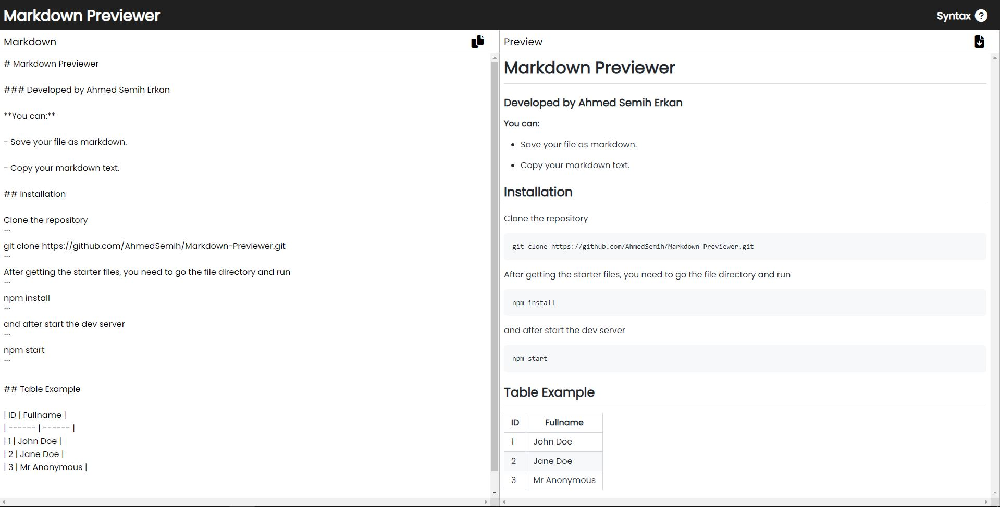

# Markdown Previewer

Markdown Previewer with React

**Live demo: [https://markdownpreviewerbyase.netlify.app/](https://markdownpreviewerbyase.netlify.app/)**

## Built with

- [React](https://reactjs.org/)

- [Remarkjs](https://github.com/remarkjs/react-markdown)

## Getting Started

Clone the repository

```
git clone https://github.com/AhmedSemih/Markdown-Previewer.git
```

After getting the starter files, you need to go the file directory and run

```
npm install
```

and after start the dev server

```
npm start
```
